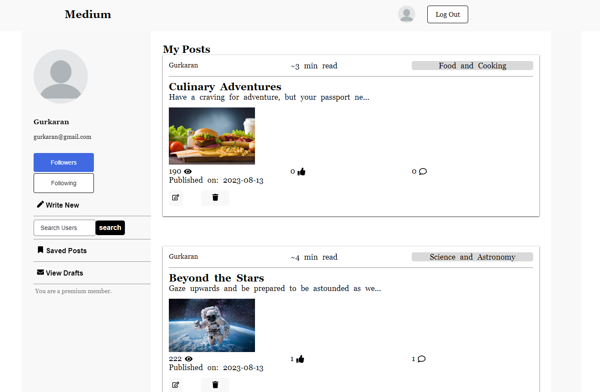
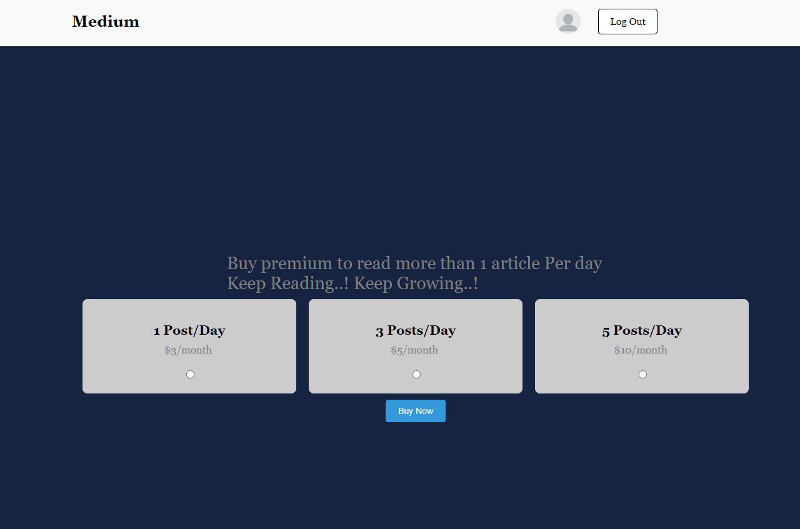

# Blog Management App

     
Sign-in/Sign-up to our medium app.

     
See your profile page and search for other users to follow/see their articles.

     
View/Like/Comment/SaveforLater any article in the feed.

     
Pay to be the premium customer of our medium app.

### Key functionalities:
- Done the auth(sign-in , sign-up) 
- Implemented Post Page(like/view/comment/saveLater) 
- Implemented Feed Page(Recommended Topics , Search Articles , View Top Post) 
- Implemented myDetails/otherProfiles Page(Followers/Following , Search other users) 
- Implemented Save Later Page 
- Implemented Add/Edit Article 
- Implemented myDetails page( Create and render post, edit post ) 
- Implemented Payment & premium membership page 
- Implemented CRUD functionality on a post 
- Implemented sorting/filtering functionality in main feed page 
  
